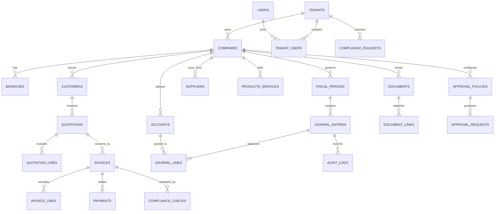

# Database ERD and Integrity Model

## 1. سياسة البيانات

جميع المبالغ `decimal(18,6)` ولا تستخدم الأعداد العائمة. تحفظ التواريخ التشغيلية بتوقيت UTC مع حقول تاريخ محاسبية عند الحاجة. يكون رقم المستند بشرياً ومقيداً بفهرس فريد، لكن المعرف الأساسي الداخلي مستقل وغير قابل لإعادة الاستخدام. كل تغيير مالي أو صلاحية حساسة يولّد سجل تدقيق مضافاً فقط.

## 2. الجداول المحورية

| المجال | الجداول الأساسية | قيود السلامة |
| --- | --- | --- |
| العزل | `tenants`, `companies`, `tenantUsers` | فريد: عضوية المستخدم ضمن المستأجر؛ كل كيان أعمالي يحمل `tenantId` |
| الوصول | `roles`, `permissions`, `rolePermissions`, `userRoleAssignments`, `approvalPolicies` | لا تمنح الواجهة صلاحية؛ القرار في الخادم مع سياق المستأجر |
| التهيئة | `branches`, `fiscalPeriods`, `costCenters`, `projects`, `numberingSequences`, `taxProfiles` | لا قيد خارج فترة مفتوحة؛ رقم مستند فريد ضمن نطاق التسلسل |
| المبيعات | `customers`, `productsServices`, `quotations`, `quotationLines`, `invoices`, `invoiceLines`, `payments` | لا إصدار دون عميل وخطوط موجبة ونتائج تحقق صالحة |
| المحاسبة | `accounts`, `journalEntries`, `journalLines`, `postingRules`, `accountingEvents` | مدين = دائن لكل قيد مرحّل؛ القيد المرحّل immutable |
| الامتثال | `complianceRulesets`, `complianceRules`, `complianceChecks`, `zatcaSubmissions` | كل فحص يربط بإصدار قاعدة ومخرجات قابلة للتدقيق |
| المستندات | `documents`, `documentLinks`, `documentClassifications` | لا تخزن ملفات في قاعدة البيانات؛ تحفظ مراجع تخزين فقط |
| التدقيق | `auditLogs`, `outboxEvents`, `idempotencyKeys` | سجل append-only، مفاتيح تكرار فريدة، أثر كامل للمحاولة |

## 3. نموذج القيد

`journalEntries` يمثل رأس القيد: الشركة، الفرع، الفترة، الحالة، التاريخ، المرجع، مصدر الحدث، القيد الأصلي إن كان عكساً، ومجموعي المدين والدائن. يمثل `journalLines` السطور: الحساب، مبلغ مدين أو دائن حصراً، مركز تكلفة، مشروع، عميل أو مورد، وصف، وتسلسل. يفرض التطبيق ومحفز الخدمة أن يكون مجموع المدين والدائن متساويين قبل تغيير الحالة إلى `posted`.

## 4. فهرسة وقيود

تُفهرس جميع جداول القراءة التشغيلية بـ`tenantId` ثم المفاتيح الشائعة مثل `status` و`issuedAt` و`customerId`. تُبنى فهارس مساندة على `(tenantId, fiscalPeriodId, status)` للقيود وعلى `(tenantId, documentType, documentNumber)` للمستندات. تفرض مفاتيح خارجية بين الرؤوس والسطور، وتعزل البيانات المرجعية المحذوفة من الإلغاء الفعلي إذا ارتبطت بسجل مالي.

