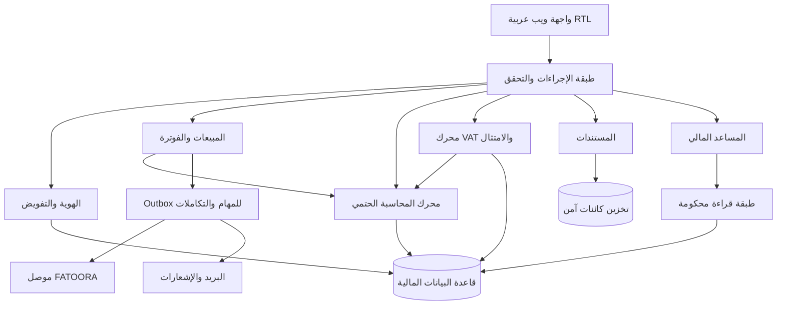

# System Architecture — CONSEDRA Finance OS

**الحالة:** أساس تصميمي للنسخة الأولى. **المبدأ الحاكم:** دفتر الأستاذ هو مصدر الحقيقة، وكل أثر مالي ينتج من قواعد حتمية قابلة للاختبار، بينما يظل الذكاء الاصطناعي مساعداً يقدّم اقتراحاً قابلاً للتفسير لا منفّذاً مستقلاً.

## 1. نطاق النواة

تبدأ المنصة كنظام مالي داخلي لشركة واحدة لكن بحدود نطاقية متعددة المستأجرين من أول جدول وأول إجراء. تشمل النواة: الهوية، المستأجرون، الشركة والفروع، العملاء والموردون، الخدمات، عروض الأسعار، الفواتير، التحصيلات، القيود، الأستاذ، التقارير، VAT، المستندات، الموافقات، وسجل التدقيق. لا يلتف أي تدفق تشغيلي حول محرك الترحيل أو سجل التدقيق.

| طبقة | المسؤولية | قاعدة التصميم |
| --- | --- | --- |
| تجربة الويب | واجهة عربية RTL، صفحات تشغيلية، لوحات الدور، إدخال مضبوط | لا تنفذ حسابات مالية نهائية في المتصفح |
| واجهة الإجراءات | عقود typed، تحقق إدخال، تفويض، مفاتيح عدم التكرار | تستدعي خدمات النطاق فقط |
| خدمات النطاق | المبيعات، المحاسبة، الضرائب، الاعتماد، المستندات | كل خدمة تقبل سياق المستأجر صراحة |
| محرك المحاسبة | إنشاء القيود والتوازن والإقفال والعكس | حتمي، معاملاتي، معزول عن AI |
| محرك الامتثال | قواعد الإصدار وVAT وZATCA ذات الإصدارات | لا تُشفّر القواعد النظامية في الواجهات |
| التكاملات | ZATCA والبنوك والبريد والتخزين | Outbox، إعادة محاولة، تتبع حالة، أسرار معزولة |
| البيانات | MySQL المعاملاتي، تخزين كائنات، سجل تدقيق append-only | `tenantId`، قيود مرجعية، مبالغ عشرية |

## 2. حدود النطاقات

يعتمد النظام **Modular Monolith**: خدمات مستقلة منطقياً ضمن نشر واحد في البداية، بواجهات نطاقية تسمح بفصلها لاحقاً دون كسر عقود البيانات. المجالات هي Identity، Tenancy، Configuration، Sales، Purchases، Accounting، Tax & Compliance، Banking، Documents، Reporting، AI، Notifications، وPlatform Administration.

## 3. عزل المستأجرين والبيانات

كل كيان أعمالي يملك `tenantId` غير قابل للتعديل بعد الإنشاء، وكل قراءة أو كتابة تمر بسياق `TenantContext` المستخلص من العضوية المصرح بها لا من مدخلات الواجهة. تُبنى الفهارس المركبة الأساسية على `(tenantId, …)`، وتكون المفاتيح الفريدة خاصة بالمستأجر حيث يلزم، مثل رقم الفاتورة. تُرفض الطلبات التي لا تحتوي سياق مستأجر صالح قبل بلوغ أي خدمة نطاقية. لا يملك مسؤول المنصة وصولاً افتراضياً لبيانات شركة؛ ويستلزم الدعم تفويضاً مؤقتاً بسبب وموافقة وسجل تدقيق.

## 4. مصدر الحقيقة والتدفقات الحرجة

لا تصبح فاتورة مالية إلا عند نجاح التحقق، اكتمال الاعتمادات، إنشاء المستند غير القابل للتغيير، وإنشاء القيد الناتج في معاملة واحدة. لا يُحذف قيد أو فاتورة مُصدرة؛ التصحيح يكون بإشعار دائن/مدين أو قيد عكسي مرتبط بالأصل. لا تُبنى التقارير المالية من مجاميع واجهة أو بيانات AI؛ بل من القيود المرحلة وطبقة تقارير قابلة للتتبّع.

| التدفق | الحدث المالي | الحماية |
| --- | --- | --- |
| قبول عرض سعر | لا قيد تلقائي | سجل إصدار وموافقة فقط |
| إصدار فاتورة | مدين العملاء / دائن الإيراد والضريبة | فحص امتثال، تسلسل ذري، قيد متوازن |
| تحصيل | مدين البنك أو الصندوق / دائن العميل | ربط بالفاتورة ومنع تجاوز الرصيد بلا اعتماد |
| فاتورة مورد | مدين المصروف أو الأصل والضريبة القابلة للاسترداد / دائن المورد | تأكيد بشري للاستخراج والاقتراحات |
| عكس قيد | القيد المعاكس للأصل | سبب إلزامي، مرجع، اعتماد بحسب السياسة |

## 5. الاعتمادية والتكامل

تُنفَّذ أي عملية خارجية غير متزامنة من سجل Outbox بعد تثبيت المعاملة المالية. يحمل كل طلب `idempotencyKey` وسجل محاولات وحالة خطأ آمنة، ولا يغيّر فشل إرسال خارجي من صحة قيد سابق. متطلبات الفوترة الإلكترونية في المملكة تُطبق على مرحلتين، وتُدمج الأنظمة الخاضعة ضمن الموجات التي تُخطر بها الهيئة؛ لذلك تُصمَّم طبقة FATOORA لتُحدَّث قواعدها وإصداراتها دون تعديل المحرك المحاسبي. [1]

## 6. حدود الذكاء الاصطناعي

يقرأ المساعد المالي Views مسموحة ومحكومة بالنطاق والصلاحية؛ وتُسجل كل إجابة ومصادرها وفترتها. يعيد حقائق محسوبة من طبقة التقارير، أو ملاحظات/توقعات/توصيات مفصولة بوضوح مع ثقة وقيود. لا يرحّل، لا يقفل فترة، لا يقدّم إقراراً، لا يعدّل قيداً، ولا يرسل مستنداً نظامياً دون عمل بشري موثق.

## 7. مراجع التصميم

[1] [ZATCA — مراحل تطبيق الفوترة الإلكترونية](https://zatca.gov.sa/en/E-Invoicing/Introduction/Pages/Roll-out-phases.aspx)

