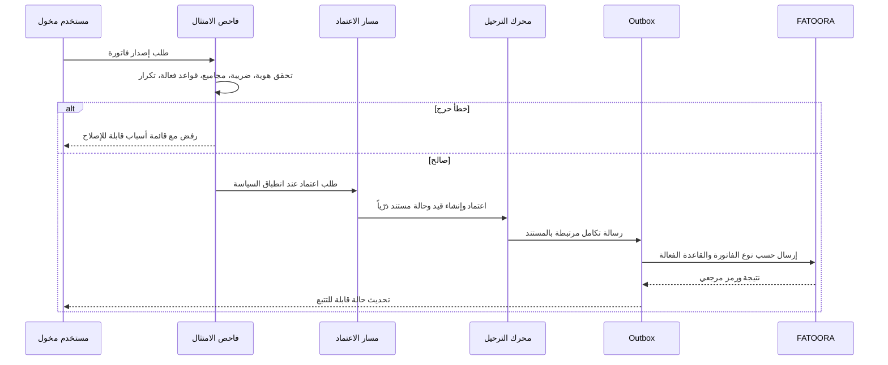

# ZATCA Integration Architecture

> **تنبيه امتثال:** هذه بنية مصممة لاستيعاب متطلبات الفوترة الإلكترونية والتكامل مع FATOORA؛ لا تمثل تصريحاً بأن البرنامج معتمد أو مخوّل من الهيئة. يجب مراجعة أحدث المواصفات التقنية والإشعارات الخاصة بالمنشأة قبل تشغيل أي تكامل إنتاجي.

تذكر الهيئة أن مرحلة التكامل تُطبق في موجات على الفئات المستهدفة، وأن المنشآت تُخطر بالموجة قبل الموعد المحدد؛ لذلك تظل أهلية التكامل وموعده وإصدار قواعده إعدادات قابلة للتدقيق على مستوى الشركة/الفرع لا افتراضات عامة. [1]

## 1. مكوّنات الموصل

| المكوّن | المهمة | ضمان السلامة |
| --- | --- | --- |
| `ComplianceRuleset` | إصدار القواعد والتواريخ والنطاق ونتائج التحقق | لا تعديل لإصدار مستخدم في مستند صادر |
| `InvoiceValidator` | تحقق حقول المستند والمجاميع والعميل والضريبة | أخطاء حرجة تمنع الإصدار؛ تحذيرات مسجلة |
| `XmlBuilder` | إنتاج UBL/XML من نموذج فاتورة غير قابل للتغير | يختبر ضد مخططات وقواعد الإصدار الفعال |
| `SigningVault` | إدارة مفاتيح التوقيع وبيانات الاعتماد بشكل معزول | لا تعرض المفاتيح أو CSID للعميل أو السجل |
| `FatooraConnector` | Onboarding، إرسال، معالجة ردود | idempotency، retry متدرج، correlation ID |
| `SubmissionTracker` | الحالات، الردود، محاولات الاسترداد | لا يكرر الإرسال بعد نجاح مثبت |

## 2. تدفق ما قبل الإصدار

## 3. نموذج الحالة والأدلة

تحفظ الفاتورة `complianceCheckId` و`rulesetVersion` و`uuid` ومعلومات تجزئة وأثر التكامل وفق ما تطلبه القاعدة الفعالة. تحفظ `zatcaSubmissions` كل طلب/استجابة بعد تنقية الأسرار، ومفتاح التكرار، ومعرف الارتباط، والتوقيت، والحالة. يحتفظ محرك المستندات بالـXML المولد ونسخة العرض القابلة للمشاركة ضمن سياسة احتفاظ قابلة للضبط.

## 4. نقاط تحقق للإطلاق

| فئة | بوابة قبول |
| --- | --- |
| قواعد النظام | مصدر رسمي مراجع، إصدار مفعّل، نطاق منشأة صحيح |
| المستند | فحص امتثال بلا أخطاء حرجة، مجاميع وقيد متوازنان |
| الأمن | أسرار في خزنة، صلاحيات فصل، تسجيل محاولات دون كشف بيانات حساسة |
| التكامل | اختبارات بيئة غير إنتاجية، أخطاء وتحويلات واسترداد موثقة |
| التشغيل | لوحة متابعة، طوابير فشل، خطة إعادة محاولة وتصعيد |

## 5. المرجع

[1] [ZATCA — مراحل تطبيق الفوترة الإلكترونية](https://zatca.gov.sa/en/E-Invoicing/Introduction/Pages/Roll-out-phases.aspx)

